# 📊 UML Diagrams for Enhanced Automata Bot

This document contains PlantUML scripts for various UML diagrams representing the Enhanced Automata Bot system architecture and workflows.

## 🎯 Use Case Diagram


## 🔄 Activity Diagram - NFA to DFA Conversion


## 📈 Activity Diagram - DFA Minimization


## 🔄 Sequence Diagram - User Interaction with AI


## 🔄 Sequence Diagram - Automaton Processing

```plantuml
@startuml SequenceDiagram_AutomatonProcessing
!theme plain
title Enhanced Automata Bot - Automaton Processing Flow

participant "User" as user
participant "Telegram Bot" as bot
participant "Menu Handler" as menu
participant "Operation Handler" as op
participant "Automata Utils" as utils
participant "DFA Algorithm" as algo
participant "AI Service" as ai
participant "Database" as db
participant "Session Manager" as session

user -> bot : Clicks "⚡ Minimize DFA"

bot -> menu : handleMinimizeDFA()
activate menu

menu -> session : getUserSession(userId)
activate session
session --> menu : User session object
deactivate session

menu -> session : updateUserSession(userId, {waitingFor: 'dfa_minimization'})

menu --> bot : Display examples and instructions
deactivate menu

bot --> user : Shows DFA examples and format

user -> bot : Sends DFA definition

bot -> op : handleSessionOperation(ctx, session, text)
activate op

op -> op : handleDFAMinimization(ctx, session, text)

op -> utils : parseDFAInput(text)
activate utils
utils --> op : Parsed DFA object
deactivate utils

op -> utils : checkFAType(dfa)
activate utils
utils --> op : "DFA" or "NFA"
deactivate utils

alt If NFA
  op -> utils : nfaToDfa(nfa)
  activate utils
  utils --> op : Converted DFA
  deactivate utils
end

op -> algo : minimizeDFA(dfa)
activate algo
algo --> op : Minimized DFA
deactivate algo

par Parallel Processing
  op -> db : saveToDatabase(userId, input, output, operation)
  activate db
  db --> op : Save confirmation
  deactivate db
and
  op -> ai : explainAutomataStep(dfa, 'minimize')
  activate ai
  ai --> op : AI explanation
  deactivate ai
end

op -> bot : sendFormattedResult(ctx, minimizedDFA, title, explanation)
deactivate op

bot --> user : ✨ **Minimized DFA**\nResult with AI explanation

@enduml
```

## 🏗️ Class Diagram - System Architecture


## 🧩 Component Diagram - System Components

```plantuml
@startuml ComponentDiagram
!theme plain
title Enhanced Automata Bot - Component Diagram

package "Enhanced Automata Bot System" {

  component "Telegram Bot Interface" as TelegramBot {
    port "User Commands" as UC
    port "Menu Interactions" as MI
    port "Text Messages" as TM
  }

  component "Handler Layer" as Handlers {
    component "Command Handlers" as CH
    component "Menu Handlers" as MH
    component "Operation Handlers" as OH

    port "Command Processing" as CP
    port "Menu Processing" as MP
    port "Operation Processing" as OP
  }

  component "Business Logic Layer" as BusinessLogic {
    component "Automata Utils" as AU
    component "DFA Algorithms" as DA
    component "Session Manager" as SM

    port "Automata Operations" as AO
    port "Algorithm Processing" as AP
    port "Session Management" as SMP
  }

  component "Service Layer" as Services {
    component "AI Service" as AIS
    component "Message Formatter" as MF

    port "AI Processing" as AIP
    port "Message Formatting" as MFP
  }

  component "Data Layer" as DataLayer {
    component "Database Config" as DC

    port "Data Persistence" as DP
  }
}

package "External Systems" {
  component "DeepSeek AI API" as DeepSeekAPI
  component "MongoDB Database" as MongoDB
  component "Telegram API" as TelegramAPI
}

' Internal connections
TelegramBot::UC --> Handlers::CP
TelegramBot::MI --> Handlers::MP
TelegramBot::TM --> Handlers::OP

Handlers::CP --> CH
Handlers::MP --> MH
Handlers::OP --> OH

CH --> Services::AIP
MH --> BusinessLogic::SMP
OH --> BusinessLogic::AO
OH --> BusinessLogic::AP
OH --> Services::AIP
OH --> DataLayer::DP

BusinessLogic::AO --> AU
BusinessLogic::AP --> DA
BusinessLogic::SMP --> SM

Services::AIP --> AIS
Services::MFP --> MF

DataLayer::DP --> DC

' External connections
TelegramBot --> TelegramAPI : "Bot API Calls"
AIS --> DeepSeekAPI : "AI Requests"
DC --> MongoDB : "Database Operations"

note top of DeepSeekAPI
  Provides AI-powered explanations
  and natural language processing
end note

note top of MongoDB
  Stores user history and
  automaton operations
end note

note top of TelegramAPI
  Handles user interactions
  and message delivery
end note

@enduml
```

## 🚀 Deployment Diagram - System Deployment


## 🔄 State Diagram - User Session States

```plantuml
@startuml StateDiagram
!theme plain
title Enhanced Automata Bot - User Session State Diagram

[*] --> Idle : User starts bot

state Idle {
  Idle : User sees main menu
  Idle : No active operation
  Idle : Can ask AI questions
}

state WaitingForInput {
  state "Waiting for FA Definition" as WaitingFA
  state "Waiting for Test String" as WaitingTest
  state "Waiting for Type Check" as WaitingType
  state "Waiting for NFA Conversion" as WaitingNFA
  state "Waiting for DFA Minimization" as WaitingMin
}

state Processing {
  state "Parsing Input" as Parsing
  state "Running Algorithm" as Algorithm
  state "Getting AI Explanation" as AIExplain
  state "Saving to Database" as Saving
  state "Formatting Result" as Formatting
}

state LearningMode {
  state "Showing Tutorial" as Tutorial
  state "Generating Examples" as Examples
  state "Practice Problems" as Practice
}

' Transitions from Idle
Idle --> WaitingFA : Click "🔧 Design FA"
Idle --> WaitingTest : Click "🧪 Test Input"
Idle --> WaitingType : Click "🔍 Check FA Type"
Idle --> WaitingNFA : Click "🔄 NFA→DFA"
Idle --> WaitingMin : Click "⚡ Minimize DFA"
Idle --> LearningMode : Click "📚 Learn Mode"
Idle --> Idle : Ask AI question

' Transitions from Waiting states
WaitingFA --> Processing : Valid FA input
WaitingTest --> Processing : Valid test string
WaitingType --> Processing : Valid FA input
WaitingNFA --> Processing : Valid NFA input
WaitingMin --> Processing : Valid DFA input

WaitingForInput --> Idle : Invalid input / Error
WaitingForInput --> Idle : Cancel operation

' Processing flow
Processing --> Parsing
Parsing --> Algorithm : Valid format
Parsing --> Idle : Invalid format

Algorithm --> AIExplain : Algorithm complete
AIExplain --> Saving : Explanation ready
Saving --> Formatting : Data saved
Formatting --> Idle : Result sent

' Learning mode transitions
LearningMode --> Tutorial : Select topic
LearningMode --> Examples : Request examples
LearningMode --> Practice : Request practice
LearningMode --> Idle : Back to main menu

Tutorial --> LearningMode : Topic complete
Examples --> LearningMode : Examples shown
Practice --> LearningMode : Practice complete

' Error handling
Processing --> Idle : Error occurred
LearningMode --> Idle : Error occurred

Idle --> [*] : User stops bot

note right of Processing
  All processing includes
  parallel AI explanation
  generation and database
  operations for efficiency
end note

@enduml
```



## 📋 How to Use These Diagrams

### 🌐 **Online Rendering**
1. Go to [PlantUML.com](http://www.plantuml.com/plantuml/uml/)
2. Copy any diagram script from above
3. Paste into the text area
4. Click "Submit" to generate the diagram

### 💻 **Local Rendering**
1. Install PlantUML locally
2. Save script to `.puml` file
3. Run: `plantuml filename.puml`

### 📊 **Diagram Types Included**
- **Use Case Diagram**: Shows system functionality and user interactions
- **Activity Diagrams**: Show workflow for NFA→DFA and DFA minimization
- **Sequence Diagrams**: Show interaction flows between components
- **Class Diagram**: Shows system architecture and relationships
- **Component Diagram**: Shows modular system structure
- **Deployment Diagram**: Shows system deployment on cloud platforms
- **State Diagram**: Shows user session state transitions

### 🎯 **Purpose of Each Diagram**
- **Use Case**: Understanding system requirements and user roles
- **Activity**: Understanding business processes and workflows
- **Sequence**: Understanding component interactions and message flow
- **Class**: Understanding code structure and relationships
- **Component**: Understanding system modularity and interfaces
- **Deployment**: Understanding production environment setup
- **State**: Understanding user session lifecycle

These diagrams provide comprehensive documentation of your Enhanced Automata Bot system architecture and behavior! 🎉
